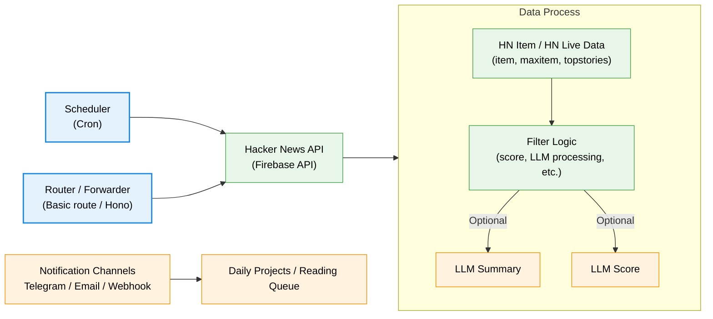

# Hacker News Worker

Hacker News Worker is a [Cloudflare Workers](https://developers.cloudflare.com/workers/) (totally written in TypeScript) service that fetches and processes Hacker News data (e.g. Top Stories🔥), then forwards selected items to downstream channels such as Telegram bot, email, webhooks, or persistent databases.

This project is based on the Python project [phil-r/hackernewsbot](https://github.com/phil-r/hackernewsbot). The original project runs on Google App Engine (GAE) platform and is written in Python 2. Thank you phil-r for creating such a tool!

## Features

- Scheduled fetching via Cloudflare Workers Cron Triggers.
- Fetches Hacker News items and live data from the official Firebase API.
- Filtering and de-duplication using KV storage (score, time, and processed item IDs).
- Telegram bot notifications using the Telegram Bot API.
- Pluggable notification layer with placeholders for email, webhooks, and database sinks.
- LLM integration hooks for:
  - Generating summaries for each Hacker News item.
  - Assigning an additional LLM-based relevance score.

## TODO

- [x] Scheduler trigger with Cron job
- [x] Data filter
- [x] Telegram notifications
- [x] Basic KV caching and de-duplication
- [ ] Email notifications
- [ ] Webhook / database sink integration
- [ ] (Optional) Implement LLM-based summaries
- [ ] (Optional) Implement LLM-based scoring and ranking

## High-level Flow

- A scheduled Cron trigger or an HTTP route invokes the Worker.
- The Worker queries the Hacker News Firebase API for items and live data.
- Items pass through a processing pipeline:
  - Basic filtering (score, recency).
  - De-duplication using KV.
  - Optional LLM summary and scoring.
- The processed items are sent to configured notification channels (Telegram, email, webhooks, etc.) or stored for later consumption (for example, a personal reading queue).

### Flowchart

## LICENSE

MIT