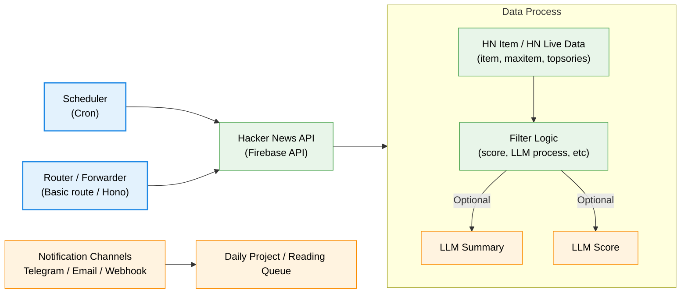

# Hacker News Worker

Mainly work on Cloudflare Workers to fetch and process Hacker News data, forward to email/telegram bot/webhook/db record.

## TODO list

+ [x] Scheduler trigger (cron)
+ [x] Devide into API redirect and page redirect
+ [x] Notify for Telegram bot
+ [ ] Notify Email
+ [ ] LLM summary and scoring
+ [ ] Implement Email notification

## Flowchart

